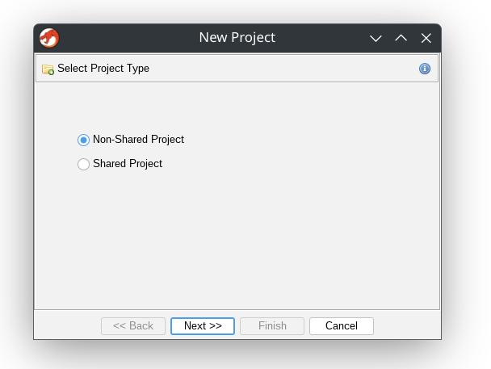
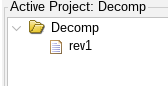
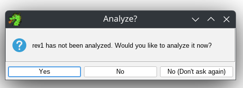
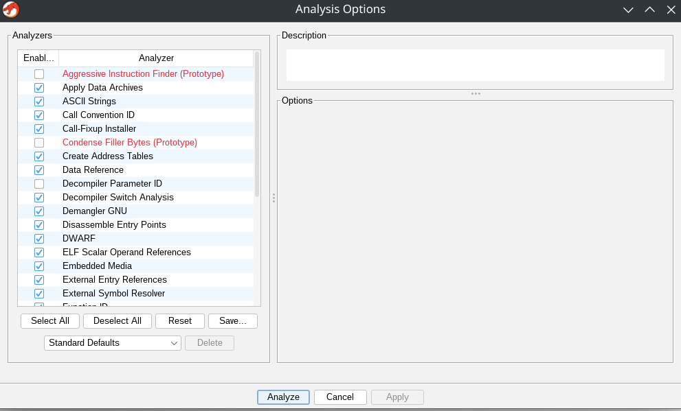
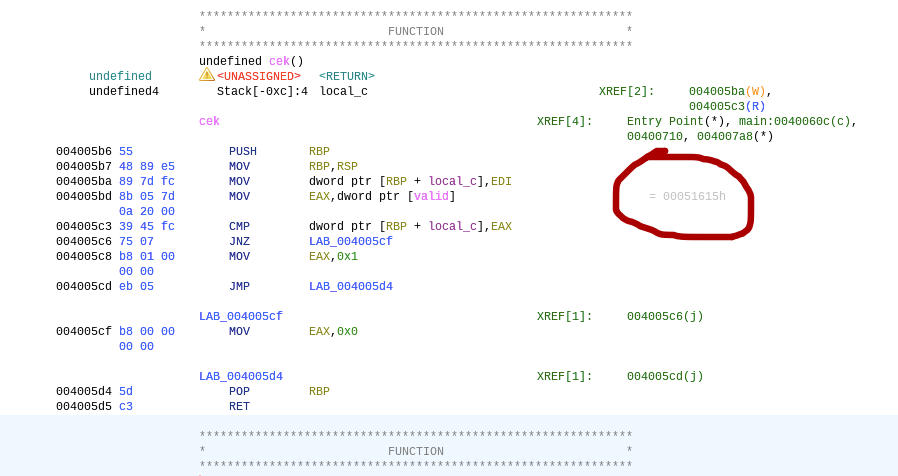

# Reverse Engineering C++ Program 

Challenge site: [CTFLearn](https://ctflearn.com/challenge/379) 
Tools used =
**Ghidra** 

## Methods

1. Open Ghidra, then make a new project 

2. Put the rev1 file into the project folder 

3. Double click on the file, and when it ask to analyze the file, click yes. 

4. Choose analyze too in here 

5. Find the function that handles the pin check, which in this case is cek(). Here, Ghidra already gives us the answer in a comment. The letter H in the end of the numbers means that its a hex code.  

6. Decode that hex code back to decimal.
7. Try inputting it in the program. If succeeds, then thats the flag.

